# YOLOX Detection
This repository provides an evaluation script for benchmarking its performance on the COCO dataset. 
The YOLOX model is based on the YOLO family of object detectors and is designed to achieve state-of-the-art 
accuracy and speed.  The evaluation script computes the standard COCO metrics (AP, AP50, and AP75) 
and provides per-category results. 

The repository also includes a review of the YOLOX paper, discussing the key contributions 
and limitations of the model. In addition to the evaluation code and review, the repository contains instructions 
for reproducing the evaluation results.

# Quick Start

<details>
<summary>Environment</summary>

Clone the repo and build the docker image

```Shell
git clone https://github.com/ahosnyyy/yolox-detection.git
cd yolox-detection
docker build --tag yolox .
```
</details>

<details>
<summary>Run</summary>

If you don't have the COCO dataset (val set is enough), then you need to run the container using

```Shell
docker run --gpus all -it -v /path/to/YOLOX:/app/YOLOX -p 8888:8888 yolox
cd YOLOX
```
and download the dataset by running the following bash script inside the container

```Shell
./datasets/download_coco.sh -s [train/val/test]
```

If you already have the dataset locally you can mount its path while running the container

```Shell
docker run --gpus all -it -v /path/to/YOLOX:/app/YOLOX -v /path/to/datasets:/app/YOLOX/datasets -p 8888:8888 yolox
cd YOLOX
```
The folder structure should be like:
```
|-- YOLOX
    |-- datasets
        |-- COCO
            |-- annotations
            |   |-- instances_train2017.json
            |   |-- instances_val2017.json
            |
            |-- train2017
            |   |-- 000000000009.jpg
            |   |-- 000000000025.jpg
            |   |-- ...
            |
            |-- val2017
                |-- 000000000139.jpg
                |-- 000000000285.jpg
                |-- ...
```
</details>

<details>
<summary>Download Models</summary>

Now you need to download the models and put them in [`/YOLOX/models`](./YOLOX/models/), you either download the models from the original [YOLOX](https://github.com/Megvii-BaseDetection/YOLOX.git) repo or use the following bash script from inside the container

```Shell
./models/download_models.sh -m [s/m/l/x/darknet/nano/tiny/all]
```
</details>

<details>
<summary>Demo</summary>

Use either -n or -f to specify your detector's config. For example:
```Shell
python3 tools/demo.py image -n yolox-s -c ./models/yolox_s.pth --path assets/ --conf 0.25 --nms 0.45 --tsize 640 --save_result --device [cpu/gpu]  
```
This will run the detection on all the images inside the [`/assets`](./YOLOX/assets/) directory, or
```Shell
python3 tools/demo.py image -f exps/default/yolox_s.py -c /path/to/your/yolox_s.pth --path assets/dog.jpg --conf 0.25 --nms 0.45 --tsize 640 --save_result --device [cpu/gpu]
```
</details>

<details>
<summary>Evaluation</summary>

For batch testing you can run
```Shell
python3 -m yolox.tools.eval -n  yolox-s -c yolox_s.pth -b 64 -d 8 --conf 0.001 [--fp16] [--fuse]
                               yolox-m
                               yolox-l
                               yolox-x
```
But to reproduce speed test use 
```Shell
python3 -m yolox.tools.eval -n  yolox-s -c yolox_s.pth -b 1 -d 1 --conf 0.001 --fp16 --fuse
                               yolox-m
                               yolox-l
                               yolox-x
``` 
</details>

## Evaluation Results

Trying to reproduce the results on COCO val2017 saet, I wrote some utility functions and integrated them inside the original YOLOX scripts to dump the results into ```json``` files in order to easily analize them. The file can be found in [`/YOLOX/YOLOX_outputs/](./YOLOX/YOLOX_outputs/)

Analyzing those results by reformatting to an easy to plot structure, you can find the reformatted results in [`/YOLOX_results/`](./YOLOX_results /). Here is a table summarize those results

| Model | Speed (ms)<br>3050 Ti | FLOPs<br>(G)| Params<br>(M)|mAP<sup>val<br>0.5 | mAP<sup>val<br>0.5:0.95 | mAR<sup>val<br>0.5:0.95 |
|:----|:-------------------:|:------:|:------:|:------:|:------------:|:------------:|
| yolox-nano | 17.07 | 1.1 | 0.9 |0.41 | 0.26 | 0.42 |
| yolox-tiny | 15.69 | 6.5 | 5.1 |0.5 | 0.33 | 0.48 |
| yolox-Darknet53 | 185.5 | 64.7 |27.51 | 0.67 | 0.48 | 0.63 |
| yolox-s | 13.60 | 27 | 9 |0.59 | 0.40 | 0.57 |
| yolox-m | 18.22 | 74 | 25.3 |0.66 | 0.47 | 0.63 |
| yolox-l | 26.18 | 156 | 54.2 |0.68 | 0.50 | 0.64 |
| yolox-x | 41.63 | 282.5 | 99.1 |0.69 | 0.51 | 0.66 |

Here is also some plots

|                      AP@0.50                      |                     AP@0.50:0.95                      |
|:-------------------------------------------------:|:-----------------------------------------------------:|
|    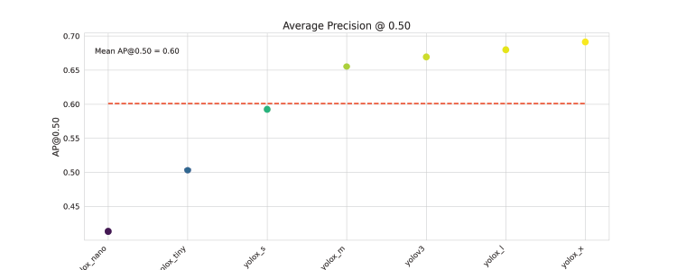    | 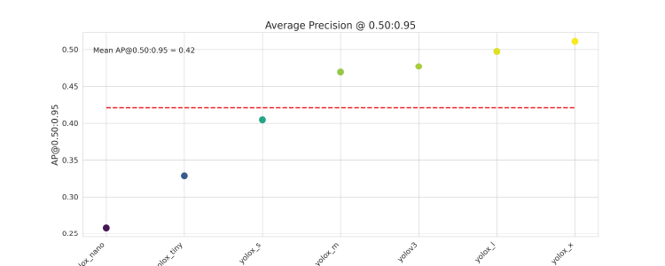 |
|                      AP@0.75                      |                     AR@0.50:0.95                      |
|   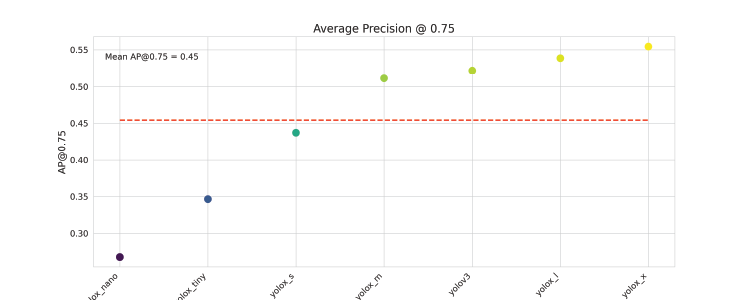    |           |
|                 AP@0.50 per class                 |                AR@0.50:0.95 per class                 |
| 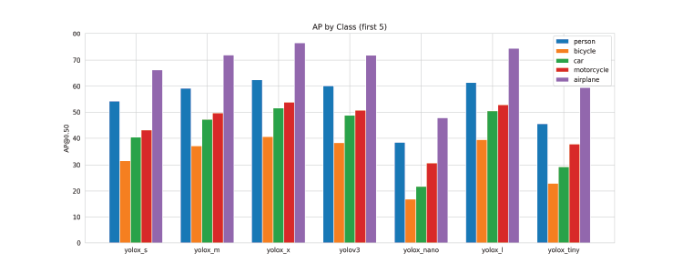 |     |
|                       Speed                       |                                                       |
|    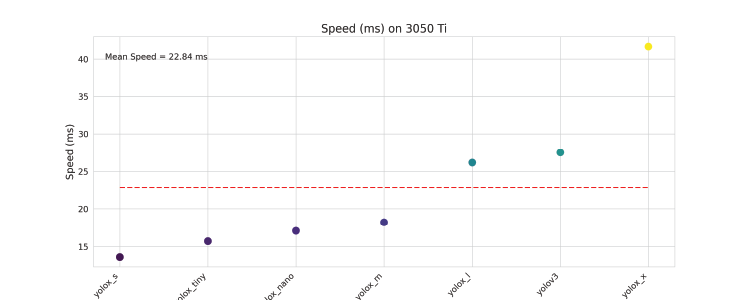     |                                                       |


## Demo Results

To evaluate the performance of YOLOX, I conducted a series of experiments using the model on a some images containing
objects of varying sizes. I experimented with different YOLOX models, ranging from the smallest version (YOLOX-S)
to the largest version (YOLOX-L), to evaluate the impact of model size on performance. The results saved 
in [`/YOLOX/YOLOX_output/`](./YOLOX/YOLOX_outputs), here is some of them:

|            |                             Image 1                             |                             Image 2                              |                             Image 3                              |
|:----------:|:---------------------------------------------------------------:|:----------------------------------------------------------------:|:----------------------------------------------------------------:|
|  Original  |                             |                             |                             |
|  yolox_s   |  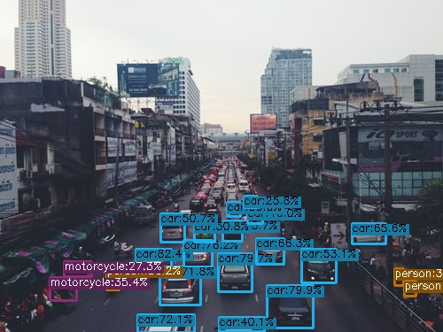   |  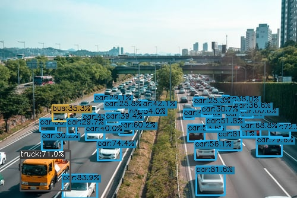   |  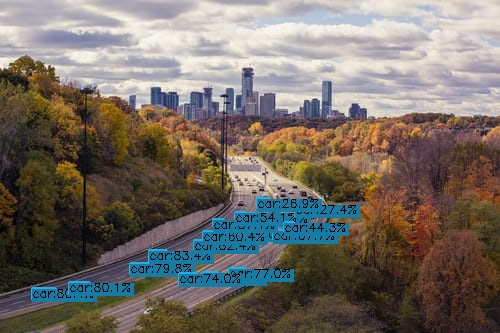   |
|  yolox_m   |  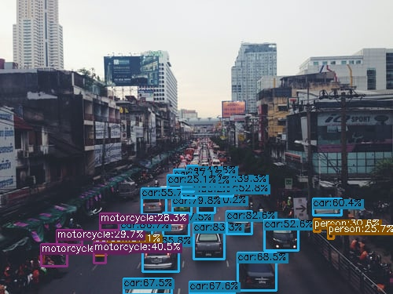   |  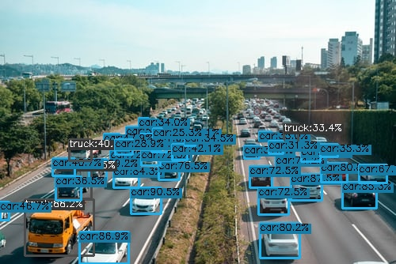   |     |
|  yolox_l   |  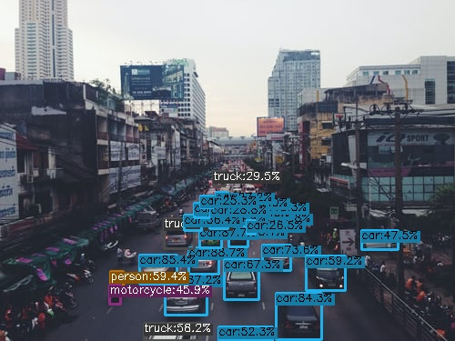   |  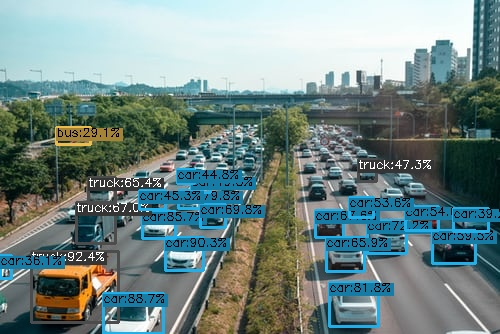   |     |
|  yolox_x   |  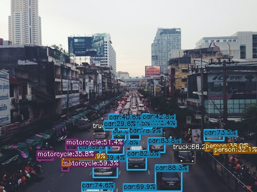   |  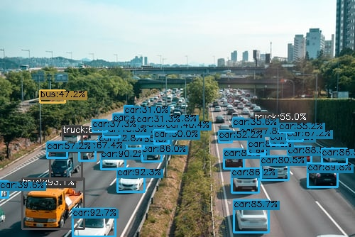   |  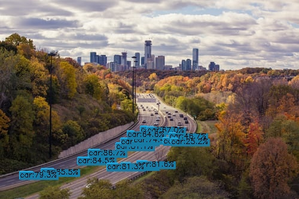   |
| yolox_nano | 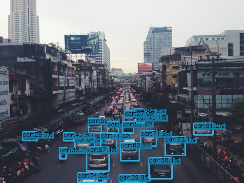 | 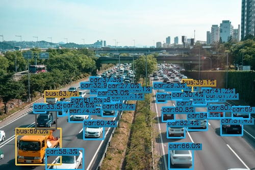 | 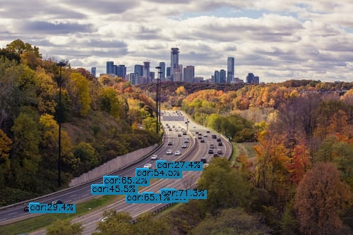 |
| yolox_tiny | 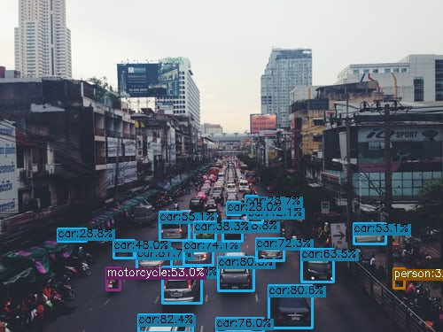 | 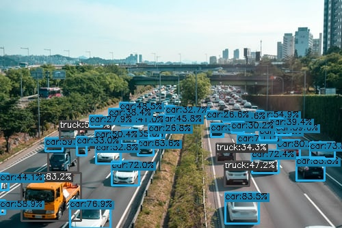 | 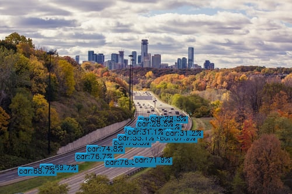 |
|   yolov3   |   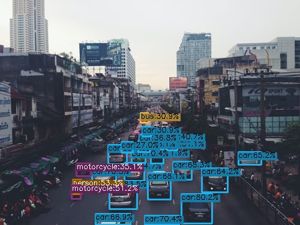   |   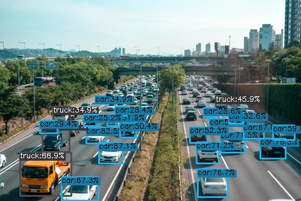   |      |

The experiments revealed that YOLOX indeed faces challenges in detecting small objects, especially when using smaller models.
I observed that the model's performance improved as I used larger models. 


## YOLOX Review

YOLOX is a single-stage real-time object detector. YOLOX introduces several new techniques, such as **anchor-free** detection, improved **feature fusion**, and **path aggregation**, to improve object detection accuracy and speed. It also introduces advanced detection techniques like **Decoupled Head** and **simOTA** label assignment strategy. Moreover, strong data augmentation like **MOSAIC** and **mixUP** are incorporated for robust training.

In short, YOLOX differs from other YOLO architectures in several ways:

- **Anchor-Free Detection**: YOLOX uses a center-based anchor-free detection approach, which eliminates the need for manually selecting anchor boxes. This simplifies the model and reduces the number of hyperparameters, while also improving accuracy on small objects.

- **Decoupled Head**: YOLOX uses a decoupled head for classification and regression tasks, which allows for more flexibility in designing the model. This approach also reduces computation requirements and improves accuracy.

- **SimOTA Label Assignment**: YOLOX uses a modified version of the optimal transport assignment (OTA) algorithm called simOTA for label assignment. SimOTA groups ground truth objects based on their similarity and assigns them to the closest predicted bounding box, which helps to reduce false negatives and overfitting.

- **Strong Data Augmentation**: YOLOX incorporates several strong data augmentation techniques, including Mosaic and MixUp, which improve the model's ability to generalize to new data.

### Anchor-Free YOLOX

Anchor-based detectors rely on predefined boxes of different sizes to generate proposals for object localization in an image. This approach results in a large number of hyperparameters associated with the anchors and requires significant computational resources. 

In contrast, anchor-free methods aim to detect objects directly without using boxes as proposals. Instead, they use **centers** or **key points** to locate the objects, which reduces the number of hyperparameters and computational requirements.

**YOLOX** adopts the center-based approach which has a per-pixel detection mechanism. In anchor based detectors, the location of the input image acts as the center for multiple anchors.

### Decoupled Head in YOLOX

Earlier YOLO networks used a coupled head architecture. All the regression and classification scores are obtained from the same head. Coupled or shared head t was doing fine until researchers at Microsoft pointed out the loopholes in 2020. The paper [Rethinking Classification and Localization for Object Detection](https://arxiv.org/abs/1904.06493) proved that there is a conflict between the regression (localization) and classification task.

While a high classification score ideally implies high localization confidence, spatial misalignment of features can cause scores to become unsynchronized, leading to negative effects on the training process.

**YOLOX** introduced a decoupled head to handle classification and regression tasks separately. This head incorporates a 1 × 1 convolutional layer that reduces the channel dimension, followed by two parallel branches, each consisting of two 3 × 3 convolutional layers.

### simOTA Label Assignment in YOLOX

Simplified Optimal Transport Assignment (simOTA) is a method for assigning labels to anchors in object detection. It is based on the optimal transport problem, which is a mathematical problem that seeks to find the most efficient way to transport goods from one location to another. In the context of object detection, the goods are the labels, and the locations are the anchors.

simOTA is a modification OTA strategy, which is designed to address the problem of assigning multiple objects to the same target during training.

The simOTA strategy is intended to improve the training process by reducing the number of false negatives and false positives, and by helping to prevent overfitting.

### Strong Data Augmentation in YOLOX

**Mixup Augmentation**, Mixup Augmentation is the weighted addition of two images. It was initially used for classification tasks but later got introduced to object detection as well.

**Mosaic Augmentation**, MOSAIC augmentation combines 4 training images into one like a plain collage and then crops in a certain ratio. MOSAIC Augmentation helps the network learn to detect smaller objects better.

## YOLOX Paper

The paper evaluates YOLOX on the MS COCO dataset. YOLOX achieves state-of-the-art results on the MS COCO dataset, both in terms of accuracy and speed. YOLOX is able to achieve real-time performance while still maintaining high accuracy.


The paper is well-written and the experiments are well-conducted. The paper provides a comprehensive overview of YOLOX and its performance. The paper is a valuable contribution to the field of object detection.

#### Here are some of the strengths of the paper:

- The paper presents a new object detection algorithm that is both accurate and fast.
- The paper evaluates YOLOX on the MS COCO dataset and achieves state-of-the-art results.
- The paper is well-written and the experiments are well-conducted.

#### Here are some of the weaknesses of the paper:

- The paper does not compare YOLOX to other state-of-the-art object detection algorithms.
- The paper does not provide any insights into why YOLOX is so fast and accurate.

# Conclusion

Although YOLOX has shown significant improvements in object detection, there are still some areas for improvement. Here are a few potential areas:

1. Handling occlusions: YOLOX could be improved to better handle object occlusions, which can be challenging for many object detection models.

2. Multi-scale detection: While YOLOX already uses a multi-scale detection approach, further improvements in this area could help improve the accuracy of detecting objects at different scales.

3. Fine-grained object detection: YOLOX has demonstrated good performance in detecting general object categories. 
However, further research could explore how to improve the model's ability to detect more fine-grained object details.

Overall, while YOLOX is an impressive object detection model, there are still opportunities for improvement in certain areas.


---

Author: Ahmed Hosny  
Email: ahmedhosny0094.ah@gmail.com


